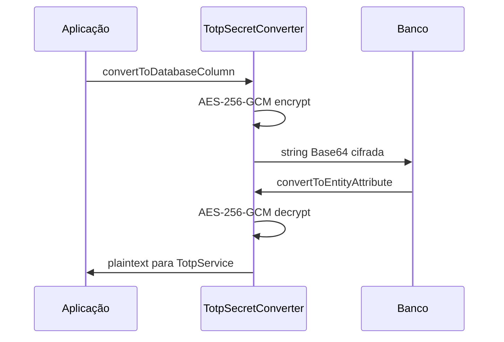

# Criptografia — CRUD Produtos

Documentação do uso de criptografia em trânsito e em repouso no projeto Spring Boot.

## Visão geral

| Camada | Dado protegido | Mecanismo | Implementação |
|--------|----------------|-----------|---------------|
| Em trânsito (cliente ↔ API) | HTTP, cookies, JSON | TLS/HTTPS | `application-local.properties`, `HttpsRedirectConfig` |
| Em trânsito (API ↔ banco) | Consultas JDBC | SSL/TLS do conector | `MYSQL_SSL_MODE`, `SPRING_DATASOURCE_URL` |
| Em trânsito (API ↔ SMTP) | E-mail de reset | STARTTLS | `spring.mail.*` (porta 587) |
| Em repouso | Senha do usuário | Hash adaptativo | BCrypt strength 12 — `PasswordService` |
| Em repouso | Segredo TOTP | Cifra simétrica autenticada | AES-256-GCM — `TotpSecretConverter` |


---

## 1. HTTPS / TLS (dados em trânsito — aplicação)

### Configuração

Perfis `local` e `dev` (`application-local.properties`, `application-dev.properties`):

| Propriedade | Valor padrão |
|-------------|--------------|
| `server.port` | 8443 |
| `server.http.port` | 8080 |
| `server.ssl.enabled` | `true` |
| `server.ssl.key-store` | `file:certs/dev-keystore.p12` |
| `server.ssl.key-store-type` | PKCS12 |
| `server.ssl.key-alias` | `tomcat` |

### Redirect HTTP → HTTPS

`HttpsRedirectConfig` (ativo quando `server.ssl.enabled=true`):

- Conector adicional na porta **8080** redireciona para **8443**.
- Constraint Tomcat `CONFIDENTIAL` força canal seguro.

### HSTS e cookie de sessão

`SecurityConfig` (com SSL ativo):

- Cabeçalho `Strict-Transport-Security` (max-age 31536000, includeSubDomains).
- `requiresChannel().anyRequest().requiresSecure()`.

`application.properties`:

```properties
server.servlet.session.cookie.secure=${server.ssl.enabled:false}
server.servlet.session.cookie.http-only=true
server.servlet.session.cookie.same-site=lax
```

### Geração do keystore

```bash
bash scripts/generate-dev-keystore.sh
```

Variáveis: `SSL_KEYSTORE_FILE`, `SSL_KEYSTORE_PASSWORD`, `SSL_KEYSTORE_ALIAS`.

---

## 2. BCrypt — senhas em repouso

### Onde está no código

| Componente | Arquivo |
|----------|---------|
| Encoder | `SecurityBeansConfig` → `BCryptPasswordEncoder` |
| Serviço | `PasswordService` |
| Configuração | `security.password.bcrypt.strength=12` |
| Coluna BD | `usuarios.password_hash` |

### Comportamento

- **Salt:** gerado automaticamente por hash; embutido no próprio valor BCrypt.
- **Custo:** strength **12** (2^12 iterações internas).
- **Operações:** `hashPassword()` no registro/reset; `matches()` no login.

### Justificativa técnica

Alinhado a **NIST SP 800-63B**: usar funções de derivação adaptativas para verificadores de senha, dificultando ataques offline por força bruta.

---

## 3. AES-256-GCM — segredo TOTP em repouso

### Onde está no código

| Componente | Arquivo |
|----------|---------|
| Conversor JPA | `TotpSecretConverter` |
| Entidade | `Usuario.totpSecret` com `@Convert(converter = TotpSecretConverter.class)` |
| Chave | `ENCRYPTION_KEY` (variável de ambiente → `System.setProperty` via `DotenvConfig`) |

### Algoritmo

| Parâmetro | Valor |
|-----------|-------|
| Algoritmo JCA | `AES/GCM/NoPadding` |
| Tamanho da chave | 256 bits (32 bytes decodificados de Base64) |
| IV | 12 bytes aleatórios (`SecureRandom`) por cifragem |
| Tag GCM | 128 bits |
| Formato no BD | Base64( IV ‖ ciphertext+tag ) |

### Fluxo de persistência



### Compatibilidade legada

Se o valor no banco não for um blob GCM válido (texto plano, Base32 curto, Base64 curto), o conversor **retorna o valor original** sem falhar — permite migração gradual de registros antigos.

### Geração da chave

```bash
openssl rand -base64 32
```

Configurar em `.env`:

```env
ENCRYPTION_KEY=<resultado-do-comando>
```

**Requisitos:** exatamente 32 bytes após decodificação Base64; nunca versionar o valor real.

### Serviço auxiliar

`EncryptionService` implementa a mesma lógica AES-GCM de forma genérica; o campo TOTP usa exclusivamente `TotpSecretConverter` na persistência JPA.

---

## 4. TOTP — segundo fator (RFC 6238)

| Item | Detalhe |
|------|---------|
| Biblioteca | `com.warrenstrange:googleauth` 1.5.0 |
| Serviço | `TotpService` |
| Janela | `windowSize=1` |
| Issuer | `security.auth.totp.issuer=crud-produtos` |
| URI QR | `otpauth://totp/{issuer}:{username}?secret=...` |

O segredo em memória é descriptografado pelo JPA ao carregar `Usuario`; em trânsito para o cliente, `TotpSetupResponse` expõe `secret` e `qrUri` apenas em HTTPS (registro ou setup 2FA).

---

## 5. TLS JDBC (aplicação ↔ banco)

| Perfil | Parâmetro padrão na URL |
|--------|-------------------------|
| `local` | `sslMode=DISABLED` |
| `dev` | `sslMode=PREFERRED` |

Sobrescrever:

```env
SPRING_DATASOURCE_URL=jdbc:postgresql://host:5432/db?sslmode=require
MYSQL_SSL_MODE=REQUIRED
```

---

## 6. SMTP STARTTLS (e-mail de reset)

```properties
spring.mail.host=smtp.gmail.com
spring.mail.port=587
spring.mail.properties.mail.smtp.starttls.enable=true
spring.mail.properties.mail.smtp.starttls.required=true
```

Serviço: `EmailService.sendPasswordResetEmail()` — token enviado no corpo do e-mail (não retornado na API em produção).

---

## 7. Matriz de conformidade (requisitos 3.x do projeto)

| Requisito | Controle | Evidência |
|-----------|----------|-----------|
| 3.1 TLS na aplicação | HTTPS 8443 + keystore | `application-local.properties`, `HttpsRedirectConfig` |
| 3.2 Bloqueio HTTP claro | Redirect 8080 → 8443 | `HttpsRedirectConfig` |
| 3.4 Dado sensível cifrado em repouso | `totp_secret` AES-GCM | `TotpSecretConverter` |
| 3.5 Algoritmo documentado | AES-256-GCM, BCrypt | Este documento + README |
| 3.6 Chave fora do código | `ENCRYPTION_KEY` no `.env` | `DotenvConfig`, `.env.example` |
| 3.7 Camadas de criptografia | TLS + BCrypt + AES-GCM + STARTTLS | Seções acima |
| 3.8 Justificativa técnica | NIST / RFC | README seção Segurança |

---

## 8. Referências técnicas

- NIST FIPS 197 — AES
- NIST SP 800-38D — Galois/Counter Mode (GCM)
- NIST SP 800-63B — armazenamento de senhas
- RFC 6238 — TOTP
- RFC 8446 — TLS 1.3

---

## Arquivos relacionados

- [security-auth-flow.md](./security-auth-flow.md) — fluxo de login e 2FA
- [password-reset.md](./password-reset.md) — reset de senha e e-mail
- [security-controls.md](./security-controls.md) — gestão de credenciais e controles
- [security-tests.md](./security-tests.md) — testes de criptografia
