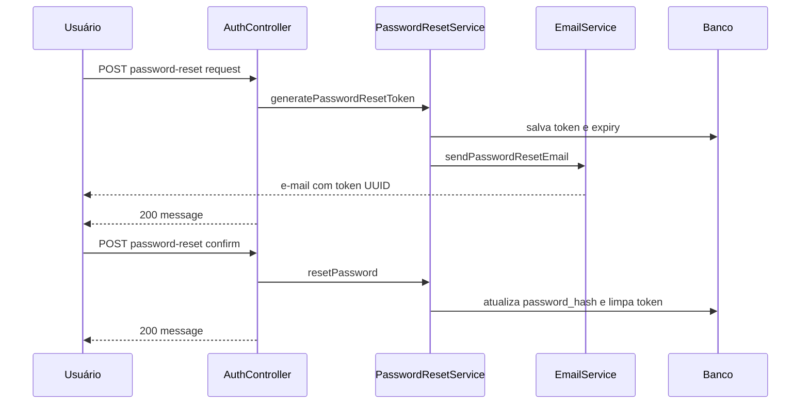

# Recuperação de senha

Documentação do fluxo de reset de senha por e-mail no CRUD Produtos.

## Visão geral

1. Usuário informa o e-mail cadastrado.
2. Backend gera token UUID (válido 30 min), persiste no banco e **envia o token por e-mail** (SMTP).
3. Usuário informa token + nova senha no endpoint de confirmação.
4. Senha é salva com BCrypt; token é removido do banco.

O token **não** é retornado na resposta HTTP da API — apenas no corpo do e-mail.



---

## Endpoints

### 1. Solicitar recuperação

**`POST /auth/password-reset/request`** — público (sem autenticação).

**Request:**

```json
{
  "email": "usuario@example.com"
}
```

**Response (200 OK):**

```json
{
  "message": "Email de recuperação enviado com sucesso. Verifique sua caixa de entrada."
}
```

**Erros:**

| Status | Condição |
|--------|----------|
| 404 | E-mail não cadastrado — `"Usuário com este email não encontrado"` |
| 400 | E-mail inválido (validação `@Email`) |

---

### 2. Confirmar nova senha

**`POST /auth/password-reset/confirm`** — público.

**Request:**

```json
{
  "token": "550e8400-e29b-41d4-a716-446655440000",
  "newPassword": "novaSenha123"
}
```

**Response (200 OK):**

```json
{
  "message": "Senha resetada com sucesso. Faça login com sua nova senha."
}
```

**Erros:**

| Status | Condição |
|--------|----------|
| 400 | Token inválido — `"Token de recuperação inválido"` |
| 400 | Token expirado — `"Token de recuperação expirado"` |
| 400 | Senha em branco ou com menos de 6 caracteres (Bean Validation) |

> **Nota:** no cadastro (`/auth/register`) a senha exige **mínimo 8** caracteres; no reset o DTO aceita **mínimo 6**.

---

## Fluxo para o usuário

1. Acessa a página "Esqueci a senha" no frontend (`https://localhost:8443` em dev).
2. Informa o e-mail e envia o formulário → `POST /auth/password-reset/request`.
3. Recebe e-mail com o **código/token UUID** (válido 30 minutos).
4. Na tela de reset, cola o token e define a nova senha → `POST /auth/password-reset/confirm`.
5. Faz login normalmente (senha + 2FA) com a nova senha.

---

## Detalhes técnicos

### Campos em `Usuario`

| Coluna | Tipo | Uso |
|--------|------|-----|
| `password_reset_token` | VARCHAR | UUID do reset |
| `password_reset_token_expiry` | DATETIME | Expiração (agora + 30 min) |

Constante: `PasswordResetService.TOKEN_EXPIRY_MINUTES = 30`.

### Segurança

| Controle | Implementação |
|----------|---------------|
| Token | UUID v4 (alta entropia) |
| Expiração | 30 minutos |
| Uso único | Token apagado após reset bem-sucedido |
| Senha em repouso | BCrypt strength 12 (`PasswordService`) |
| Token na API | Não exposto no JSON de resposta |
| E-mail em trânsito | SMTP porta 587 com STARTTLS |

### Envio de e-mail

| Componente | Arquivo |
|------------|---------|
| Serviço de reset | `PasswordResetService` |
| Envio SMTP | `EmailService` |
| Configuração | `application.properties` (`spring.mail.*`, `app.mail.*`) |

Após gerar o token, o serviço chama:

```java
emailService.sendPasswordResetEmail(usuario.getEmail(), usuario.getNome(), token);
```

Template padrão (pode ser sobrescrito via propriedades):

- Assunto: `app.mail.reset.subject` (padrão: *Recuperação de Senha - CRUD Produtos*)
- Corpo: `app.mail.reset.template` — saudação com nome do usuário + token UUID

### Variáveis de ambiente necessárias

| Variável | Descrição |
|----------|-----------|
| `MAIL_USERNAME` | Conta SMTP (ex.: Gmail) |
| `MAIL_PASSWORD` | Senha de app do Gmail |
| `MAIL_FROM` | Remetente (opcional; padrão em `application.properties`) |

Sem credenciais de mail configuradas, o envio falha em runtime ao solicitar reset.

---

## Configuração SMTP

Já incluído no projeto (`spring-boot-starter-mail`):

```properties
spring.mail.host=smtp.gmail.com
spring.mail.port=587
spring.mail.username=${MAIL_USERNAME}
spring.mail.password=${MAIL_PASSWORD}
spring.mail.properties.mail.smtp.auth=true
spring.mail.properties.mail.smtp.starttls.enable=true
spring.mail.properties.mail.smtp.starttls.required=true

app.mail.from=${MAIL_FROM:...}
app.mail.reset.subject=Recuperacao de Senha - CRUD Produtos
```

Copie [.env.example](../.env.example) para `.env` e preencha `MAIL_*`.

---

## Testes com cURL

Perfis `local` / `dev` usam **HTTPS na porta 8443**. Use `-k` para certificado autoassinado.

### Solicitar reset

```bash
curl -k -X POST https://localhost:8443/auth/password-reset/request \
  -H "Content-Type: application/json" \
  -d "{\"email\":\"usuario@example.com\"}"
```

Resposta esperada: apenas `message` (sem `resetToken`). Verifique o e-mail para obter o token.

### Confirmar reset

```bash
curl -k -X POST https://localhost:8443/auth/password-reset/confirm \
  -H "Content-Type: application/json" \
  -d "{\"token\":\"SEU-TOKEN-DO-EMAIL\",\"newPassword\":\"novaSenha123\"}"
```

---

## Estrutura de arquivos

```
src/main/java/umc/devapp/crud_produtos/
├── controller/
│   └── AuthController.java          # endpoints /auth/password-reset/*
├── dto/auth/
│   ├── PasswordResetRequest.java
│   ├── ConfirmPasswordResetRequest.java
│   ├── PasswordResetResponse.java   # somente campo message
│   └── AuthMessageResponse.java     # resposta do confirm
├── service/
│   ├── PasswordResetService.java
│   ├── EmailService.java
│   └── PasswordService.java         # BCrypt
├── entity/
│   └── Usuario.java                 # token + expiry
└── repository/
    └── UsuarioRepository.java       # findByEmail, findByPasswordResetToken
```

---

## Melhorias futuras (opcional)

- **Rate limiting** em `/password-reset/request` (evitar spam de e-mail).
- **Resposta genérica** mesmo quando o e-mail não existe (reduz enumeração de contas).
- **Link clicável** no e-mail (`https://.../reset.html?token=...`) em vez de apenas o código no texto.
- **Logs de auditoria** de solicitações de reset.
- **Alinhar política de senha** do reset com o registro (mínimo 8 caracteres).

---

## Arquivos relacionados

- [security-auth-flow.md](./security-auth-flow.md) — login após reset
- [cryptography.md](./cryptography.md) — BCrypt e STARTTLS
- [security-controls.md](./security-controls.md) — variáveis `.env` e endpoints
- [risk-analysis.md](./risk-analysis.md) — risco de enumeração de e-mail (404)
