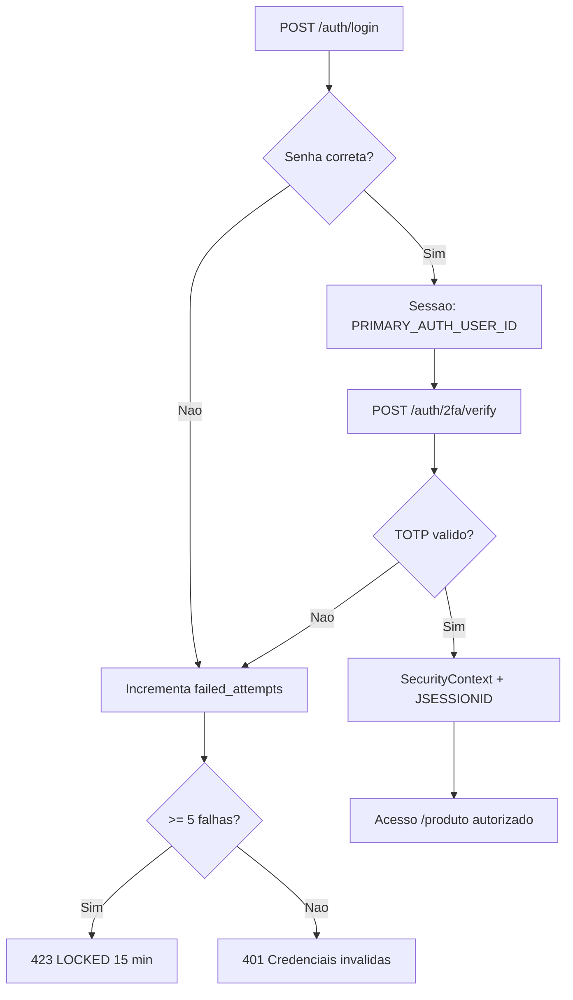

# Analise de riscos — ameacas, vulnerabilidades e contramedidas

Documentacao para apoio a trabalhos academicos (secao 6.7–6.8) e revisao de seguranca do CRUD Produtos.

## 1. Escopo

- API REST Spring Boot (`/auth`, `/produto`)
- Frontend estatico servido pelo mesmo host
- Banco relacional (MySQL / PostgreSQL)
- E-mail SMTP (recuperacao de senha)
- Ambientes: desenvolvimento local (`local`, `dev`) com HTTPS autoassinado

---

## 2. Metodologia

A analise combina:

- **STRIDE** — categorias de ameaca por componente
- **OWASP Top 10 / ASVS** — falhas comuns em aplicacoes web
- **Matriz risco × contramedida** — ligacao entre ameaca e controle implementado no codigo

Escala de impacto / probabilidade (qualitativa):

| Nivel | Impacto | Probabilidade |
|-------|---------|---------------|
| Critico / Alta | Comprometimento total de conta ou vazamento em massa | Facil de explorar sem autenticacao |
| Medio | Acesso parcial ou degradacao | Exige condicoes especificas |
| Baixo | Informacao limitada ou inconveniencia | Dificil ou apenas em dev |

---

## 3. Identificacao de ameacas e vulnerabilidades

### 3.1 Diagrama de superficie de ataque

```mermaid
flowchart TB
    subgraph externos [Atacante externo]
        ATK[Atacante]
    end

    subgraph superficie [Superficie de ataque]
        API[/auth /produto]
        STATIC[HTML/JS estatico]
        HTTP[Porta 8080 HTTP]
        SMTP_IN[Caixa de e-mail vitima]
    end

    subgraph internos [Ativos internos]
        SESS[Sessao JSESSIONID]
        BD[(Banco)]
        ENV[.env / chaves]
    end

    ATK --> API
    ATK --> STATIC
    ATK --> HTTP
    ATK --> SMTP_IN
    API --> SESS
    API --> BD
    ENV -.->|vazamento Git| ATK
```

### 3.2 Tabela de ameacas (STRIDE)

| ID | Categoria STRIDE | Ameaca | Descricao | Vetor |
|----|------------------|--------|-----------|-------|
| T01 | Spoofing | Personificacao por roubo de sessao | Uso do cookie `JSESSIONID` de outra sessao | XSS, MITM, malware local |
| T02 | Tampering | Alteracao de produto alheio | IDOR — mudar `id` de produto de outro usuario | API `/produto/*` autenticada |
| T03 | Repudiation | Negacao de acoes | Falta de trilha de auditoria centralizada | Logs apenas em aplicacao |
| T04 | Information Disclosure | Vazamento de segredos no Git | `.env`, keystore no repositorio | Commit acidental |
| T05 | Information Disclosure | Enumeracao de e-mail no reset | Resposta 404 revela e-mail inexistente | `POST /auth/password-reset/request` |
| T06 | Denial of Service | Bloqueio de conta legitima | Forca bruta invertida — travar conta alheia | 5 falhas → lock 15 min |
| T07 | Elevation of Privilege | Bypass de 2FA | Acesso a `/produto` sem `2fa/verify` | Sessao so com login primario |
| T08 | Spoofing | Forca bruta senha/TOTP | Tentativas automatizadas | `/auth/login`, `/auth/2fa/verify` |
| T09 | Information Disclosure | Sniffing em rede | Tráfego sem TLS | HTTP sem redirect em prod mal configurada |
| T10 | Tampering | CSRF em acoes autenticadas | Requisicao forjada com cookie da vitima | CSRF desabilitado |
| T11 | Information Disclosure | Segredo TOTP no JSON | `secret` exposto no registro/setup | Resposta `TotpSetupResponse` |
| T12 | Information Disclosure | JDBC sem TLS | Credenciais/dados legiveis na rede | `sslMode=DISABLED` no perfil local |

### 3.3 Vulnerabilidades e configuracoes de risco

| ID | Vulnerabilidade | Severidade | Observacao no projeto |
|----|-----------------|------------|------------------------|
| V01 | CSRF desabilitado | Media | `SecurityConfig.csrf.disable()` |
| V02 | CORS `allowedOriginPatterns("*")` | Media | Aceita qualquer origem com credentials |
| V03 | Certificado autoassinado | Media (dev) | MITM se usuario aceitar certificado falso |
| V04 | Politica de senha fraca | Baixa–Media | Apenas minimo 8 caracteres |
| V05 | Documentacao desalinhada | Baixa | Manter docs sincronizados com o codigo |
| V06 | `.env` pode nao estar no `.gitignore` | Alta se ocorrer | Validar antes de push |
| V07 | Mensagem generica vs 404 no reset | Baixa | Equilibrio UX vs enumeracao |

---

## 4. Matriz risco × contramedida

| ID | Risco | Impacto | Prob. | Contramedida | Status | Referencia |
|----|-------|---------|-------|--------------|--------|------------|
| T01 | Roubo de sessao | Alto | Media | Cookie HttpOnly, Secure (HTTPS), SameSite=Lax, timeout 30m, logout | Implementado | `SecurityConfig`, `application.properties` |
| T02 | IDOR produtos | Alto | Media | `findByIdAndUsuario`, `findByUsuario` | Implementado | `ProdutoService` |
| T03 | Sem auditoria | Baixo | Alta | Logs em `AuthService` | Parcial | Adicionar auditoria BD |
| T04 | Vazamento `.env`/keystore | Critico | Baixa | `.gitignore`, `.env.example`, docs | Implementado* | [security-controls.md](./security-controls.md) |
| T05 | Enumeracao e-mail | Baixo | Media | 404 explicito no reset | Aceito / Parcial | `PasswordResetService` |
| T06 | Lock conta alheia | Medio | Media | Lock temporario 15 min | Implementado | `BruteForceProtectionService` |
| T07 | Bypass 2FA | Alto | Baixa | `/produto/**` exige `authenticated()` apos verify | Implementado | `SecurityConfig` |
| T08 | Forca bruta | Alto | Media | 5 tentativas + lock; BCrypt 12 | Implementado | `BruteForceProtectionService` |
| T09 | Sniffing | Alto | Media | HTTPS 8443, HSTS, redirect 8080 | Implementado (local/dev) | `HttpsRedirectConfig` |
| T10 | CSRF | Medio | Media | — | **Nao implementado** | Avaliar token CSRF em prod |
| T11 | TOTP no JSON | Medio | Media | HTTPS; expor secret so no setup | Mitigado | `TotpSetupResponse` |
| T12 | JDBC claro | Medio | Variavel | `MYSQL_SSL_MODE`, URL PostgreSQL `sslmode=require` | Configuravel | `application-*.properties` |
| V01 | CSRF off | Medio | Media | SameSite + origem unica em prod | Pendente | — |
| V02 | CORS aberto | Medio | Baixa | Restringir origens em producao | Pendente | `SecurityConfig` |
| V03 | Cert dev | Medio | Alta (dev) | CA valida em producao | Planejado prod | — |
| V04 | Senha fraca | Medio | Media | `@Size(min=8)` | Parcial | Validacao adicional opcional |
| T08 | Token reset | Alto | Baixa | UUID, 30 min, uso unico, STARTTLS | Implementado | `PasswordResetService`, `EmailService` |

\* Confirmar `.env` no `.gitignore` do repositorio em uso.

---

## 5. Diagrama — fluxo de risco no login



---

## 6. Riscos residuais aceitos (desenvolvimento)

| Risco | Justificativa de aceitacao |
|-------|---------------------------|
| Certificado autoassinado | Ambiente local; usuario confia manualmente |
| `sslMode=DISABLED` no MySQL local | Banco na mesma maquina; TLS JDBC em producao |
| CSRF desabilitado | Frontend same-origin; API cookie-based em dev |
| CORS `*` | Facilita testes; restringir em deploy |

---

## 7. Recomendacoes para producao

1. Certificado TLS de CA confiavel (Let's Encrypt, etc.).
2. Adicionar `.env` ao `.gitignore` se ainda nao estiver.
3. Restringir CORS a origem do frontend em producao.
4. Habilitar protecao CSRF ou usar `SameSite=Strict` + validacao de origem.
5. Exigir `sslmode=require` (PostgreSQL) ou `REQUIRED` (MySQL) no JDBC.
6. Politica de senha: complexidade (maiuscula, numero, simbolo) ou zxcvbn.
7. Rate limiting em `/auth/password-reset/request`.
8. Testes de integracao MockMvc para fluxos M1–M13 ([security-tests.md](./security-tests.md)).
9. Implementar link clicavel no e-mail de reset (hoje envia apenas o token no corpo).

---

## 8. Normas e referencias (analise)

| Referencia | Uso na analise |
|------------|----------------|
| OWASP Top 10 2021 | A01 Access Control, A02 Crypto, A07 Auth |
| OWASP ASVS | Requisitos de sessao, credenciais, criptografia |
| NIST SP 800-63B | Politica de senhas e autenticadores |
| LGPD (Lei 13.709/2018) | Dados pessoais: e-mail, nome |
| ISO/IEC 27001 | Gestao de ativos e controles (framework) |

Entradas ABNT completas: ver secao 6.12 do material de visao geral ou incluir no trabalho a partir destas fontes oficiais.

---

## Arquivos relacionados

- [security-controls.md](./security-controls.md) — ativos e controles
- [cryptography.md](./cryptography.md) — contramedidas criptograficas
- [security-tests.md](./security-tests.md) — evidencias de teste
- [security-auth-flow.md](./security-auth-flow.md) — fluxo de autenticacao
