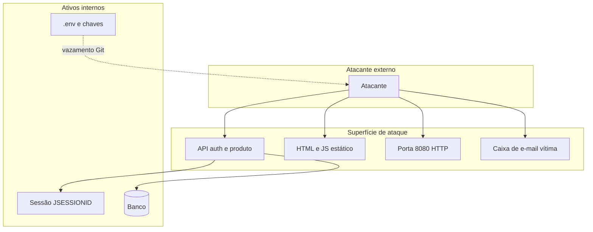
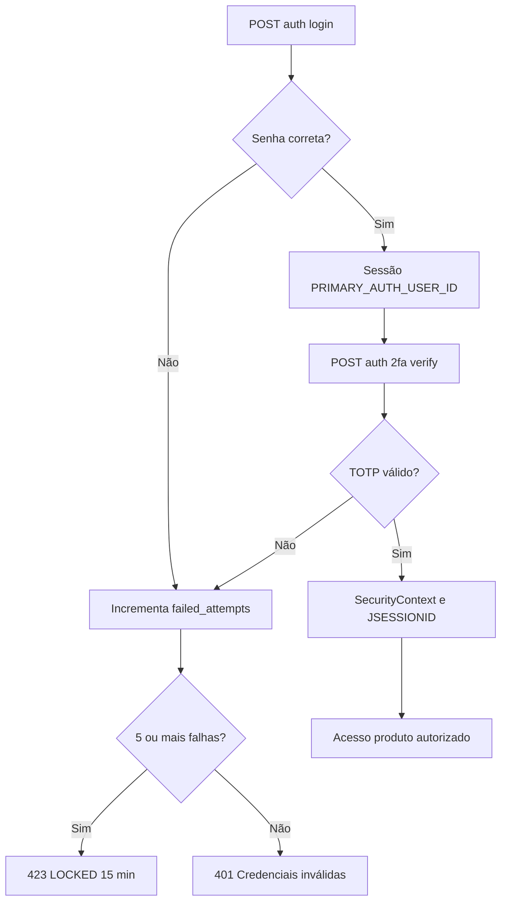

# Análise de riscos — ameaças, vulnerabilidades e contramedidas

Documentação para apoio a trabalhos acadêmicos (seção 6.7–6.8) e revisão de segurança do CRUD Produtos.

## 1. Escopo

- API REST Spring Boot (`/auth`, `/produto`)
- Frontend estático servido pelo mesmo host
- Banco relacional (MySQL / PostgreSQL)
- E-mail SMTP (recuperação de senha)
- Ambientes: desenvolvimento local (`local`, `dev`) com HTTPS autoassinado

---

## 2. Metodologia

A análise combina:

- **STRIDE** — categorias de ameaça por componente
- **OWASP Top 10 / ASVS** — falhas comuns em aplicações web
- **Matriz risco × contramedida** — ligação entre ameaça e controle implementado no código

Escala de impacto / probabilidade (qualitativa):

| Nível | Impacto | Probabilidade |
|-------|---------|---------------|
| Crítico / Alta | Comprometimento total de conta ou vazamento em massa | Fácil de explorar sem autenticação |
| Médio | Acesso parcial ou degradação | Exige condições específicas |
| Baixo | Informação limitada ou inconveniência | Difícil ou apenas em dev |

---

## 3. Identificação de ameaças e vulnerabilidades

### 3.1 Diagrama de superfície de ataque

### 3.2 Tabela de ameaças (STRIDE)

| ID | Categoria STRIDE | Ameaça | Descrição | Vetor |
|----|------------------|--------|-----------|-------|
| T01 | Spoofing | Personificação por roubo de sessão | Uso do cookie `JSESSIONID` de outra sessão | XSS, MITM, malware local |
| T02 | Tampering | Alteração de produto alheio | IDOR — mudar `id` de produto de outro usuário | API `/produto/*` autenticada |
| T03 | Repudiation | Negação de ações | Falta de trilha de auditoria centralizada | Logs apenas em aplicação |
| T04 | Information Disclosure | Vazamento de segredos no Git | `.env`, keystore no repositório | Commit acidental |
| T05 | Information Disclosure | Enumeração de e-mail no reset | Resposta 404 revela e-mail inexistente | `POST /auth/password-reset/request` |
| T06 | Denial of Service | Bloqueio de conta legítima | Força bruta invertida — travar conta alheia | 5 falhas → lock 15 min |
| T07 | Elevation of Privilege | Bypass de 2FA | Acesso a `/produto` sem `2fa/verify` | Sessão só com login primário |
| T08 | Spoofing | Força bruta senha/TOTP | Tentativas automatizadas | `/auth/login`, `/auth/2fa/verify` |
| T09 | Information Disclosure | Sniffing em rede | Tráfego sem TLS | HTTP sem redirect em prod mal configurada |
| T10 | Tampering | CSRF em ações autenticadas | Requisição forjada com cookie da vítima | CSRF desabilitado |
| T11 | Information Disclosure | Segredo TOTP no JSON | `secret` exposto no registro/setup | Resposta `TotpSetupResponse` |
| T12 | Information Disclosure | JDBC sem TLS | Credenciais/dados legíveis na rede | `sslMode=DISABLED` no perfil local |

### 3.3 Vulnerabilidades e configurações de risco

| ID | Vulnerabilidade | Severidade | Observação no projeto |
|----|-----------------|------------|------------------------|
| V01 | CSRF desabilitado | Média | `SecurityConfig.csrf.disable()` |
| V02 | CORS `allowedOriginPatterns("*")` | Média | Aceita qualquer origem com credentials |
| V03 | Certificado autoassinado | Média (dev) | MITM se usuário aceitar certificado falso |
| V04 | Política de senha fraca | Baixa–Média | Apenas mínimo 8 caracteres |
| V05 | Documentação desalinhada | Baixa | Manter docs sincronizados com o código |
| V06 | `.env` pode não estar no `.gitignore` | Alta se ocorrer | Validar antes de push |
| V07 | Mensagem genérica vs 404 no reset | Baixa | Equilíbrio UX vs enumeração |

---

## 4. Matriz risco × contramedida

| ID | Risco | Impacto | Prob. | Contramedida | Status | Referência |
|----|-------|---------|-------|--------------|--------|------------|
| T01 | Roubo de sessão | Alto | Média | Cookie HttpOnly, Secure (HTTPS), SameSite=Lax, timeout 30m, logout | Implementado | `SecurityConfig`, `application.properties` |
| T02 | IDOR produtos | Alto | Média | `findByIdAndUsuario`, `findByUsuario` | Implementado | `ProdutoService` |
| T03 | Sem auditoria | Baixo | Alta | Logs em `AuthService` | Parcial | Adicionar auditoria BD |
| T04 | Vazamento `.env`/keystore | Crítico | Baixa | `.gitignore`, `.env.example`, docs | Implementado* | [security-controls.md](./security-controls.md) |
| T05 | Enumeração e-mail | Baixo | Média | 404 explícito no reset | Aceito / Parcial | `PasswordResetService` |
| T06 | Lock conta alheia | Médio | Média | Lock temporário 15 min | Implementado | `BruteForceProtectionService` |
| T07 | Bypass 2FA | Alto | Baixa | `/produto/**` exige `authenticated()` após verify | Implementado | `SecurityConfig` |
| T08 | Força bruta | Alto | Média | 5 tentativas + lock; BCrypt 12 | Implementado | `BruteForceProtectionService` |
| T09 | Sniffing | Alto | Média | HTTPS 8443, HSTS, redirect 8080 | Implementado (local/dev) | `HttpsRedirectConfig` |
| T10 | CSRF | Médio | Média | — | **Não implementado** | Avaliar token CSRF em prod |
| T11 | TOTP no JSON | Médio | Média | HTTPS; expor secret só no setup | Mitigado | `TotpSetupResponse` |
| T12 | JDBC claro | Médio | Variável | `MYSQL_SSL_MODE`, URL PostgreSQL `sslmode=require` | Configurável | `application-*.properties` |
| V01 | CSRF off | Médio | Média | SameSite + origem única em prod | Pendente | — |
| V02 | CORS aberto | Médio | Baixa | Restringir origens em produção | Pendente | `SecurityConfig` |
| V03 | Cert dev | Médio | Alta (dev) | CA válida em produção | Planejado prod | — |
| V04 | Senha fraca | Médio | Média | `@Size(min=8)` | Parcial | Validação adicional opcional |
| T08 | Token reset | Alto | Baixa | UUID, 30 min, uso único, STARTTLS | Implementado | `PasswordResetService`, `EmailService` |

\* Confirmar `.env` no `.gitignore` do repositório em uso.

---

## 5. Diagrama — fluxo de risco no login

---

## 6. Riscos residuais aceitos (desenvolvimento)

| Risco | Justificativa de aceitação |
|-------|---------------------------|
| Certificado autoassinado | Ambiente local; usuário confia manualmente |
| `sslMode=DISABLED` no MySQL local | Banco na mesma máquina; TLS JDBC em produção |
| CSRF desabilitado | Frontend same-origin; API cookie-based em dev |
| CORS `*` | Facilita testes; restringir em deploy |

---

## 7. Recomendações para produção

1. Certificado TLS de CA confiável (Let's Encrypt, etc.).
2. Adicionar `.env` ao `.gitignore` se ainda não estiver.
3. Restringir CORS à origem do frontend em produção.
4. Habilitar proteção CSRF ou usar `SameSite=Strict` + validação de origem.
5. Exigir `sslmode=require` (PostgreSQL) ou `REQUIRED` (MySQL) no JDBC.
6. Política de senha: complexidade (maiúscula, número, símbolo) ou zxcvbn.
7. Rate limiting em `/auth/password-reset/request`.
8. Testes de integração MockMvc para fluxos M1–M13 ([security-tests.md](./security-tests.md)).
9. Implementar link clicável no e-mail de reset (hoje envia apenas o token no corpo).

---

## 8. Normas e referências (análise)

| Referência | Uso na análise |
|------------|----------------|
| OWASP Top 10 2021 | A01 Access Control, A02 Crypto, A07 Auth |
| OWASP ASVS | Requisitos de sessão, credenciais, criptografia |
| NIST SP 800-63B | Política de senhas e autenticadores |
| LGPD (Lei 13.709/2018) | Dados pessoais: e-mail, nome |
| ISO/IEC 27001 | Gestão de ativos e controles (framework) |

Entradas ABNT completas: ver seção 6.12 do material de visão geral ou incluir no trabalho a partir destas fontes oficiais.

---

## Arquivos relacionados

- [security-controls.md](./security-controls.md) — ativos e controles
- [cryptography.md](./cryptography.md) — contramedidas criptográficas
- [security-tests.md](./security-tests.md) — evidências de teste
- [security-auth-flow.md](./security-auth-flow.md) — fluxo de autenticação
