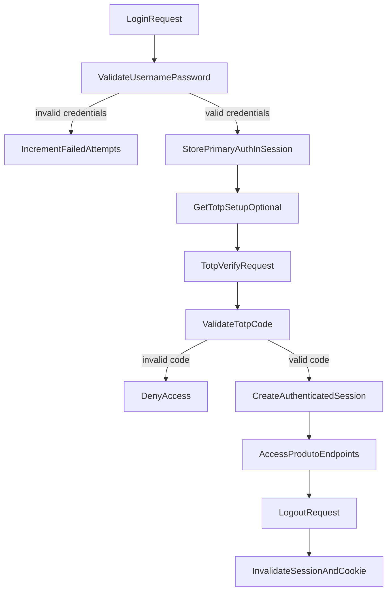

# Plano de seguranca implementado (itens 1.1-1.12)

## 1.1 a 1.4 - Senha com hash seguro, custo, salt e armazenamento

- Algoritmo utilizado: `BCrypt` (`BCryptPasswordEncoder`).
- Parametro de custo: `security.password.bcrypt.strength=12`.
- Justificativa tecnica:
  - custo 12 aumenta o tempo de derivacao para dificultar ataques offline;
  - ainda e pratico para autenticacao em API de pequeno/medio porte.
- Salt por usuario: o BCrypt gera salt aleatorio por hash automaticamente.
- Armazenamento: apenas o hash completo e salvo em `usuarios.password_hash`.
  - O formato do BCrypt embute versao, custo e salt no proprio hash.

## 1.5 e 1.6 - 2FA com TOTP apos autenticacao primaria

- Segunda etapa: TOTP via app autenticador (Google Authenticator/Authy).
- Secret unico por usuario em `usuarios.totp_secret`.
- Fluxo:
  1. `POST /auth/login` valida usuario e senha.
  2. Sessao guarda estado parcial `PRIMARY_AUTH_USER_ID`.
  3. `POST /auth/2fa/verify` valida TOTP.
  4. Em sucesso, o usuario vira autenticado na sessao Spring Security.

## 1.7 - Fluxo documentado

## 1.8 - Evidencias funcionais (testes e logs)

- Testes adicionados:
  - `PasswordServiceTest` valida hash, match e salting implicito.
  - `AuthSecurityPropertiesTest` valida parametros de sessao/custo/brute force.
- Logs esperados de runtime:
  - bloqueio temporario por tentativas falhas (HTTP 423);
  - erro de 2FA invalido (HTTP 401);
  - sucesso de login em 2 etapas (HTTP 200).

## 1.9 e 1.10 - Sessao e logout

- Expiracao de sessao: `server.servlet.session.timeout=30m`.
- Invalidação:
  - endpoint `POST /auth/signout` invalida explicitamente a sessao;
  - `SecurityConfig` tambem configura invalidacao de sessao no `/auth/logout`.

## 1.11 - Protecao contra forca bruta

- Configuracoes:
  - `security.auth.max-attempts=5`
  - `security.auth.lock-duration-minutes=15`
- Comportamento:
  - incrementa falhas por erro de senha/TOTP;
  - ao atingir limite, usuario recebe bloqueio temporario.

## 1.12 - Justificativas tecnicas

- BCrypt foi escolhido por ser padrao maduro no ecossistema Spring Security.
- TOTP reduz impacto de vazamento de senha.
- Sessao stateful simplifica invalidacao imediata de autenticacao no logout.
- Bloqueio temporario reduz efetividade de tentativa automatizada em massa.
