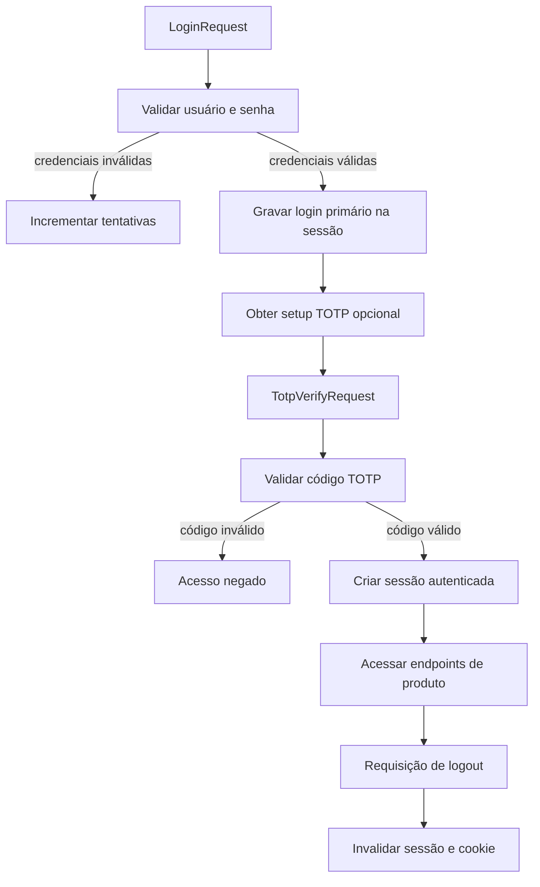

# Plano de segurança implementado (itens 1.1–1.12)

## 1.1 a 1.4 — Senha com hash seguro, custo, salt e armazenamento

- Algoritmo utilizado: `BCrypt` (`BCryptPasswordEncoder`).
- Parâmetro de custo: `security.password.bcrypt.strength=12`.
- Justificativa técnica:
  - custo 12 aumenta o tempo de derivação para dificultar ataques offline;
  - ainda é prático para autenticação em API de pequeno/médio porte.
- Salt por usuário: o BCrypt gera salt aleatório por hash automaticamente.
- Armazenamento: apenas o hash completo é salvo em `usuarios.password_hash`.
  - O formato do BCrypt embute versão, custo e salt no próprio hash.

## 1.5 e 1.6 — 2FA com TOTP após autenticação primária

- Segunda etapa: TOTP via app autenticador (Google Authenticator/Authy).
- Secret único por usuário em `usuarios.totp_secret`.
- Fluxo:
  1. `POST /auth/login` valida usuário e senha.
  2. Sessão guarda estado parcial `PRIMARY_AUTH_USER_ID`.
  3. `POST /auth/2fa/verify` valida TOTP.
  4. Em sucesso, o usuário vira autenticado na sessão Spring Security.

## 1.7 — Fluxo documentado

## 1.8 — Evidências funcionais (testes e logs)

- Testes adicionados:
  - `PasswordServiceTest` valida hash, match e salting implícito.
  - `AuthSecurityPropertiesTest` valida parâmetros de sessão/custo/brute force.
- Logs esperados de runtime:
  - bloqueio temporário por tentativas falhas (HTTP 423);
  - erro de 2FA inválido (HTTP 401);
  - sucesso de login em 2 etapas (HTTP 200).

## 1.9 e 1.10 — Sessão e logout

- Expiração de sessão: `server.servlet.session.timeout=30m`.
- Invalidação:
  - endpoint `POST /auth/signout` invalida explicitamente a sessão;
  - `SecurityConfig` também configura invalidação de sessão no `/auth/logout`.

## 1.11 — Proteção contra força bruta

- Configurações:
  - `security.auth.max-attempts=5`
  - `security.auth.lock-duration-minutes=15`
- Comportamento:
  - incrementa falhas por erro de senha/TOTP;
  - ao atingir limite, usuário recebe bloqueio temporário.

## 1.12 — Justificativas técnicas

- BCrypt foi escolhido por ser padrão maduro no ecossistema Spring Security.
- TOTP reduz impacto de vazamento de senha.
- Sessão stateful simplifica invalidação imediata de autenticação no logout.
- Bloqueio temporário reduz efetividade de tentativa automatizada em massa.
