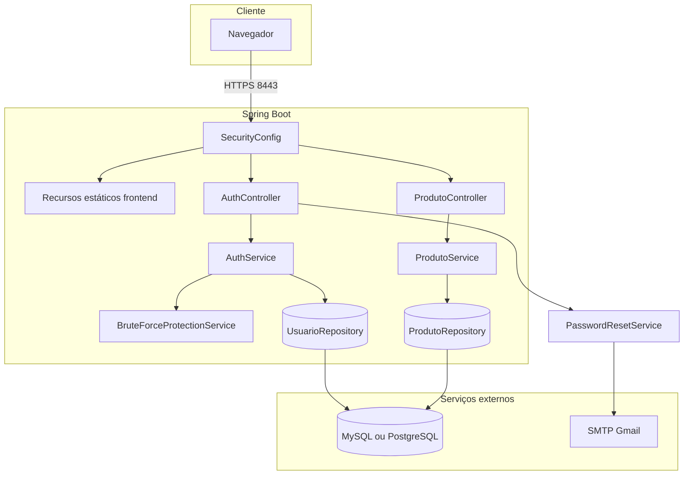

# Controles de segurança e gestão de credenciais

Documentação dos controles implementados, gestão de segredos e identificação de ativos do sistema CRUD Produtos.

## 1. Arquitetura lógica



### Camadas

| Camada | Pacote | Responsabilidade |
|--------|--------|------------------|
| Apresentação | `controller` | HTTP, validação (`@Valid`), status codes |
| Negócio | `service` | Autenticação, CRUD, e-mail, proteção |
| Persistência | `repository`, `entity` | JPA, isolamento por usuário |
| Contratos | `dto.auth` | JSON request/response |
| Infraestrutura | `config` | Security, HTTPS, dotenv, criptografia |

---

## 2. Diagrama de implantação


| Componente | Porta / protocolo |
|------------|-------------------|
| HTTPS API + frontend | 8443 (TLS) |
| HTTP redirect | 8080 → 8443 |
| JDBC | conforme URL (3306 MySQL, etc.) |
| SMTP | 587 (STARTTLS) |

---

## 3. Gestão de credenciais

### 3.1 Princípios

1. **Segredos fora do código-fonte** — arquivo `.env` carregado por `DotenvConfig`.
2. **Não versionar valores reais** — `.env`, `*.p12`, `/certs/` excluídos ou ignorados no Git.
3. **Senhas apenas como hash** — coluna `password_hash` (BCrypt).
4. **Segredo TOTP cifrado no BD** — `TotpSecretConverter` (AES-256-GCM).
5. **Autenticação stateful** — sessão HTTP + cookie `JSESSIONID`.

### 3.2 Variáveis de ambiente

| Variável | Finalidade | Obrigatório |
|----------|------------|-------------|
| `APP_PROFILE` | Perfil Spring (`local`, `dev`) | Não (padrão: `local`) |
| `PG_USER` | Usuário JDBC | Sim |
| `PG_PASSWORD` | Senha JDBC | Sim |
| `SPRING_DATASOURCE_URL` | URL JDBC completa | Não |
| `MYSQL_SSL_MODE` | SSL do MySQL Connector/J | Não |
| `MAIL_USERNAME` | Conta SMTP | Sim |
| `MAIL_PASSWORD` | Senha de app Gmail | Sim |
| `MAIL_FROM` | Remetente | Não |
| `ENCRYPTION_KEY` | Chave AES-256 (Base64, 32 bytes) | Sim |
| `SSL_KEYSTORE_PASSWORD` | Senha do keystore PKCS12 | Não |
| `SSL_KEYSTORE_FILE` | Caminho alternativo do `.p12` | Não |
| `SSL_KEYSTORE_ALIAS` | Alias da chave no keystore | Não |

Template: [.env.example](../.env.example)

### 3.3 Carregamento do `.env`

```java
// DotenvConfig — bloco static executado na inicialização
Dotenv.configure().ignoreIfMissing().load()
    → System.setProperty(chave, valor)
```

Spring resolve `${VAR}` em `application.properties` a partir de propriedades do sistema / ambiente.

### 3.4 Política de senhas

| Regra | Implementação |
|-------|---------------|
| Tamanho mínimo | 8 caracteres (`RegisterRequest` — `@Size(min = 8)`) |
| Armazenamento | BCrypt strength 12 |
| Reset | Nova senha hasheada; token UUID invalidado após uso |

### 3.5 Sessão HTTP

| Parâmetro | Valor |
|-----------|-------|
| Timeout | 30 minutos |
| Cookie HttpOnly | `true` |
| Cookie Secure | `true` quando `server.ssl.enabled=true` |
| SameSite | `Lax` |
| Identificador | `JSESSIONID` |

### 3.6 Proteção contra força bruta

| Parâmetro | Propriedade | Valor |
|-----------|-------------|-------|
| Máx. tentativas | `security.auth.max-attempts` | 5 |
| Bloqueio | `security.auth.lock-duration-minutes` | 15 min |
| Campos BD | `failed_attempts`, `lock_until` | `Usuario` |
| HTTP bloqueado | — | **423 LOCKED** |

Serviço: `BruteForceProtectionService` — incrementa em falha de senha ou TOTP; zera em sucesso do 2FA.

---

## 4. Spring Security — regras de acesso

`SecurityConfig`:

| Recurso | Acesso |
|---------|--------|
| `/auth/**` | Público |
| `/`, `/login.html`, `/scripts/**`, `/styles/**`, `/images/**`, `/**/*.html` (GET) | Público |
| `/produto/**` | Autenticado |
| Demais rotas | Autenticado |

Outros controles:

- CSRF desabilitado (`csrf.disable()`)
- Form login / HTTP Basic desabilitados
- CORS: `allowedOriginPatterns("*")`, `allowCredentials(true)`
- Logout Spring: `/auth/logout` (invalida sessão e cookie)
- Logout aplicação: `POST /auth/signout` (`AuthService.logout`)

---

## 5. Isolamento de dados (multi-usuário)

Cada usuário acessa apenas seus produtos:

```java
// ProdutoService
produtoRepository.findByUsuario(getCurrentUser())
produtoRepository.findByIdAndUsuario(id, getCurrentUser())
```

Usuário atual obtido via `SecurityContextHolder.getContext().getAuthentication().getName()`.

---

## 6. Identificação de ativos

### 6.1 Software

| ID | Ativo | Criticidade |
|----|-------|-------------|
| A1 | Aplicação Spring Boot (API + servidor estático) | Alta |
| A2 | Frontend `crud-springboot-front` | Média |
| A3 | Código-fonte e dependências Maven | Alta |
| A4 | Keystore TLS (`dev-keystore.p12`) | Alta |

### 6.2 Dados

| ID | Ativo | Local | Criticidade |
|----|-------|-------|-------------|
| D1 | Cadastro de usuários (`usuarios`) | BD | Alta |
| D2 | `password_hash` | BD | Crítica |
| D3 | `totp_secret` (cifrado) | BD | Crítica |
| D4 | Tokens de reset | BD | Alta |
| D5 | Estoque (`produtos`) | BD | Média |
| D6 | Sessões HTTP | Memória Tomcat | Alta |

### 6.3 Credenciais e chaves

| ID | Ativo | Armazenamento | Criticidade |
|----|-------|---------------|-------------|
| K1 | `ENCRYPTION_KEY` | `.env` / SO | Crítica |
| K2 | `PG_PASSWORD` | `.env` | Crítica |
| K3 | `MAIL_PASSWORD` | `.env` | Alta |
| K4 | `SSL_KEYSTORE_PASSWORD` | `.env` | Alta |
| K5 | Cookie `JSESSIONID` | Cliente | Alta |

### 6.4 Infraestrutura

| ID | Ativo |
|----|-------|
| I1 | Servidor de banco (MySQL/PostgreSQL) |
| I2 | Servidor SMTP |
| I3 | Host de desenvolvimento / produção |

---

## 7. Endpoints e respostas (referência)

### Autenticação (`/auth`)

| Método | Path | Auth | Resposta 200 |
|--------|------|------|--------------|
| POST | `/register` | Não | `TotpSetupResponse` |
| POST | `/login` | Não | `AuthMessageResponse` |
| POST | `/2fa/setup` | Sessão parcial | `TotpSetupResponse` |
| POST | `/2fa/verify` | Sessão parcial | `AuthMessageResponse` |
| POST | `/signout` | Não | `AuthMessageResponse` |
| POST | `/password-reset/request` | Não | `PasswordResetResponse` |
| POST | `/password-reset/confirm` | Não | `AuthMessageResponse` |

### Produtos (`/produto`)

| Método | Path | Auth | Resposta |
|--------|------|------|----------|
| GET | `/listall` | Sim | 200 — lista JSON |
| GET | `/list/{id}` | Sim | 200 / 404 |
| POST | `/add` | Sim | 201 — mensagem |
| PUT | `/update` | Sim | 200 — `Produto` |
| DELETE | `/delete/{id}` | Sim | 204 |

Detalhes de auth: [security-auth-flow.md](./security-auth-flow.md)  
Detalhes de reset: [password-reset.md](./password-reset.md)

---

## 8. Checklist operacional

- [ ] Copiar `.env.example` → `.env` e preencher valores
- [ ] Gerar `ENCRYPTION_KEY` com `openssl rand -base64 32`
- [ ] Executar `scripts/generate-dev-keystore.sh` antes de HTTPS local
- [ ] Nunca commitar `.env` nem keystores reais
- [ ] Em produção: certificado CA válido, CORS restrito, revisar CSRF

---

## Arquivos relacionados

- [cryptography.md](./cryptography.md)
- [risk-analysis.md](./risk-analysis.md)
- [security-tests.md](./security-tests.md)
